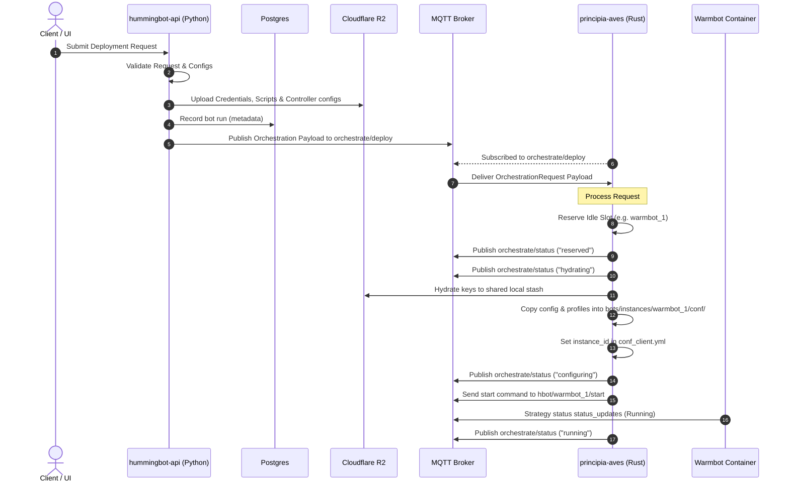

# Bot Deployment & Hydration Flow

This document details how `principia-aves` retrieves deployment files from Cloudflare R2 and prepares the localized configurations inside the target warmbot instance's directory.

## End-to-End Orchestration Flow



### The Orchestration Request

#### 1. Origin & Trigger
The orchestration request is originated from the Python API backend (**`hummingbot-api`**). When a user requests a bot deployment via the web application or API, `hummingbot-api` validates the request, writes all required files to the Cloudflare R2 bucket, creates a metadata record in the Postgres database, and initiates the process by publishing a JSON payload to the MQTT broker.

#### 2. Communication Channel
The communication happens over the MQTT broker:
- **Topic**: `orchestrate/deploy`
- **Publisher**: `hummingbot-api`
- **Subscriber**: `principia-aves` (Rust sidecar)

#### 3. Payload Structure (`OrchestrationRequest`)
The MQTT message delivered to `orchestrate/deploy` is structured as follows:

```json
{
  "request_id": "orch-bot_20260516155007-20260516-155013",
  "instance_name": "bot_20260516155007-20260516-155013",
  "strategy_type": "controller",
  "strategy_name": "v2_with_controllers",
  "credentials_profile": "master_account",
  "script_config": "warmbot_1-20260516-155013.yml",
  "controllers_config": [
    "controller_1.yml"
  ],
  "r2": {
    "prefix": "bots",
    "keys": {
      "credential_profile": "bots/credentials/master_account",
      "script_config": "bots/conf/scripts/warmbot_1-20260516-155013.yml",
      "controllers": [
        "bots/conf/controllers/controller_1.yml"
      ],
      "scripts_runtime": null,
      "controllers_runtime": null
    }
  },
  "deployment_config": {}
}
```

## 1. R2 Hydration (Staging)

During an orchestration deployment request, keys matching the `OrchestrationR2Keys` definition are downloaded from the Cloudflare R2 bucket and saved into a shared local directory on disk:

| Key Field / Type | Source Path in R2 Bucket | Destination in Shared Stash |
| :--- | :--- | :--- |
| **Credentials Profile** | `bots/credentials/<profile_name>/` (Recursive Folder) | `bots/credentials/<profile_name>/` |
| **Script Configuration** | `bots/conf/scripts/<script_config_name>` (Single File) | `bots/conf/scripts/<script_config_name>` |
| **Controllers** | `bots/conf/controllers/<controller_config_name>` (List of files) | `bots/conf/controllers/<controller_config_name>` |
| **Scripts Runtime** | `bots/conf/scripts/runtime/` (Recursive Folder, optional) | `bots/conf/scripts/runtime/` |
| **Controllers Runtime** | `bots/conf/controllers/runtime/` (Recursive Folder, optional) | `bots/conf/controllers/runtime/` |

---

## 2. Local Copying & Prep (Stash to Warmbot Instance)

Once files are successfully hydrated, the sidecar copies the stash configurations directly into the specific target warmbot slot directory (`bots/instances/<warmbot_id>/conf/`):

### A. Credentials Profile
All files and folders under `bots/credentials/<profile_name>/` are copied recursively directly into:
```text
bots/instances/<warmbot_id>/conf/
```

> [!NOTE]
> Any subdirectories or files in the profile literally named `scripts` or `controllers` are skipped during this copy process to avoid clashing with strategy configs.

### B. Client Configuration (`conf_client.yml`)
If `conf_client.yml` was successfully copied from the credentials profile, the sidecar automatically overrides the `instance_id` field inside the YAML file to match the target warmbot name:
```yaml
instance_id: warmbot_1
```

### C. Script Configuration File
The strategy's script configuration YAML is copied into:
```text
bots/instances/<warmbot_id>/conf/scripts/<script_config_name>
```

### D. Controller Configurations
All requested controller YAML configuration files are copied into:
```text
bots/instances/<warmbot_id>/conf/controllers/<controller_config_name>
```
